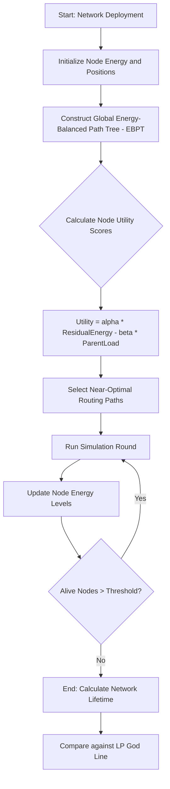

# Vanguard-WSN Algorithm Flow

```mermaid
graph TD
    A[Start: Network Deployment] --> B[Initialize Node Energy and Positions]
    B --> C[Construct Global Energy-Balanced Path Tree - EBPT]
    C --> D{Calculate Node Utility Scores}
    D --> E[Utility = alpha * ResidualEnergy - beta * ParentLoad]
    E --> F[Select Near-Optimal Routing Paths]
    F --> G[Run Simulation Round]
    G --> H[Update Node Energy Levels]
    H --> I{Alive Nodes > Threshold?}
    I -- Yes --> G
    I -- No --> J[End: Calculate Network Lifetime]
    J --> K[Compare against LP God Line]
```

*Figure 1: High-level architectural flow of the Vanguard-WSN heuristic compared against theoretical optimal bounds.*
